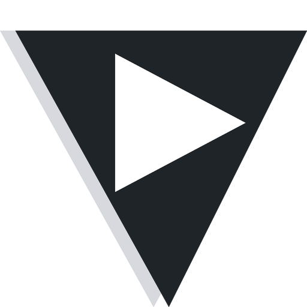

# VisionEngine Skills

[](README.md)
[](README-zh.md)

Agent Skills collection for VisionEngine — packaging the platform's media AI capabilities into skills that Claude Code or any agent can call directly.



## Install

```bash
# Option 1: install via the skills CLI
npx skills add vecai-dev/skills
npx skills add vecai-dev/skills --skill visionengine --agent claude-code --copy -y  # non-interactive

# Option 2: copy the skill into your skills directory
cp -r skills/visionengine ~/.claude/skills/visionengine          # user-level
cp -r skills/visionengine <project>/.claude/skills/visionengine  # project-level
```

Interactive install asks which agents and which skills to install. Add `-y` to skip the prompts, and
`--copy` to copy files instead of symlinking (recommended on Windows, where symlinks require
Developer Mode or administrator rights).

## Configuration

All skills share a single API key. Service endpoints have built-in defaults, so no extra configuration is needed:

```bash
export VISION_ENGINE_API_KEY=<get yours at https://www.visionengine-tech.com/keys>
```

## Available skills

### /visionengine

A zero-dependency Python CLI (standard library only) covering image generation / editing / recognition / prompt reverse, text-to-speech and voice cloning, subtitle generation and forced alignment, image-to-video / text-to-video / style transfer / video understanding, digital-human lip sync, Remotion workspace file management and remote rendering, and LLM copywriting.

Example prompts:

- Generate a 9:16 vertical cover image with a cyberpunk city night scene
- Clone my voice from this talking-head video, then read a welcome message with it
- Upload ./bgm.mp3 to my Remotion workspace, then render the MyVideo composition
- Generate Chinese subtitles for this video and export a .srt file

See [skills/visionengine/SKILL.md](skills/visionengine/SKILL.md) for details.

## Repository layout

```
skills/                       # repo root (GitHub: vecai-dev/skills)
├── README.md                 # this file
├── README-zh.md              # Chinese documentation
├── LICENSE                   # MIT
└── skills/visionengine/      # the skill
    ├── SKILL.md              # triggers, command map, core workflows
    ├── README.md             # skill-level docs (install, config, commands)
    ├── CHANGELOG.md          # changelog
    ├── icon.png              # icon
    ├── scripts/              # ve.py (entry) + _ve_client.py / _ve_commands.py
    ├── references/           # per-domain reference docs
    └── assets/               # bundled offline voice catalog
```

## License

[MIT](LICENSE)
